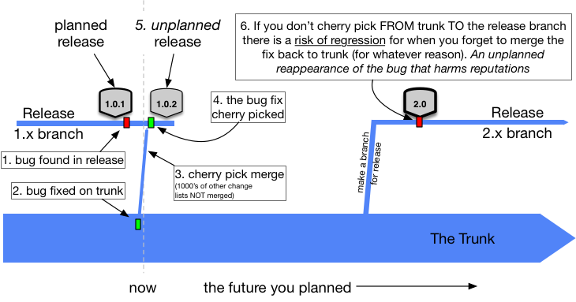

<!-- sectionTitle: Continuous Integration Oriented (Trunk-based Dev) -->

## Continuous Integration Oriented (Trunk-based Dev)

---

<header class="bg-secondary">Intégration Continue <svg class="fa-long-arrow-right"><use xlink:href="#fa-long-arrow-right"></use></svg> Continuous Integration Oriented (Trunk-based Dev)</header>

### Principes de base

[Trunk-Based Development](http://kean.github.io/post/trunk-based-development)

  

    </img>
    

      <ul class="flexblock specs">
        <li>
1 branche <code>!=</code> 1 feature, 1 branche <code>=</code> 1 petite révision (2h de taf, 2j maxi)
</li>
        <li>
on merge ASAP
</li>
        <li>
une seule branche de collaboration (le trunk / <code>master</code>)
</li>
        <li>
<code>master</code> est toujours stable et déployable
</li>
        <li>
chaque révision est déployée en env de test, recette, QA, ...
</li>
      </ul>
    

  

---

<header class="bg-secondary">Intégration Continue <svg class="fa-long-arrow-right"><use xlink:href="#fa-long-arrow-right"></use></svg> Continuous Integration Oriented (Trunk-based Dev)</header>

### Gestion du scope fonctionnel :

 

Via feature toggle (ou flipping, ou flags)

 

- 1er commit d'une feature implémente le toggle
- généralement au runtime mais peut aussi être réalisé au build
- peuvent servir pour A/B testing
- on merge avec tous les toggles activés
- on peut scoper les releases via toggle

 

Quand une feature est OK, le toggle est supprimé de la codebase.
Sinon c'est plus du toggle mais de la configuration, donc une feature en soi.

 

**La complexité de la gestion des branches est transférée dans la complexité applicative.**

---

<header class="bg-secondary">Intégration Continue <svg class="fa-long-arrow-right"><use xlink:href="#fa-long-arrow-right"></use></svg> Continuous Integration Oriented (Trunk-based Dev)</header>

### Gestion des MEP

</img>

 

- MEP a échéances fixes
  - on crée release branch depuis `master` pour préparer les MEP (QA)
  - on fix les bugs levés par QA sur `master`
  - on **cherry-pick** de `master` vers release-branch
- hotfix
  - on crée une release branch depuis le dernier tag en prod
  - on dev le hotfix sur `master`
  - on **cherry-pick** de `master` vers release-branch
- on peut MEP quand on veut (Continuous Delivery)
- on peut MEP à chaque révision (Continuous Deployment)
  - stade ultime du chemin DevOps
  - un commit mergé dans `master` va automatiquement en prod si pipeline OK

---

<header class="bg-secondary">Intégration Continue <svg class="fa-long-arrow-right"><use xlink:href="#fa-long-arrow-right"></use></svg> Continuous Integration Oriented (Trunk-based Dev)</header>

### Prérequis 

 

- suppose automatisation totale des tests (acceptance inclus)
- suppose une infra solide
- nécessite provisionning d'environnement
- feature toggle (ou flipping, ou flags) obligatoire

---

<header class="bg-secondary">Intégration Continue <svg class="fa-long-arrow-right"><use xlink:href="#fa-long-arrow-right"></use></svg> Continuous Integration Oriented (Trunk-based Dev)</header>

### Avantages

 

- intégration continue effective
- facile de pousser/récupérer du travail transverse
- code review rapides et faciles
- conflits petits et faciles si pas inexistants
- régressions visibles immédiatement
- fluide (pas d'emboutillage, pas de période de freeze)
- scalabilité
- très facile de changer de scope fonctionnel à la demande

---

<header class="bg-secondary">Intégration Continue <svg class="fa-long-arrow-right"><use xlink:href="#fa-long-arrow-right"></use></svg> Continuous Integration Oriented (Trunk-based Dev)</header>

### Inconvénients

 

- historique dégueux (impossible de générer un CHANGELOG lisible)
- feature flipping pénible à gérer
  - augmente la complexité
  - augmente la combinatoire des tests
  - gérer les différents environnements
- nécessite une équipe majoritairement senior sur la pratique

---

<header class="bg-secondary">Intégration Continue <svg class="fa-long-arrow-right"><use xlink:href="#fa-long-arrow-right"></use></svg> Continuous Integration Oriented (Trunk-based Dev)</header>

### DevOps

Point de vue DevOps c'est aujourd'hui l'état de l'art en matière de gestion de codebase.

 

  

    </img>
    

      
Cf "Accelerate, The Science of Lean Software and DevOps: Building and Scaling High Performing Technology Organizations"

      
27 mars 2018

      
https://itrevolution.com/book/accelerate/
      
    

  

